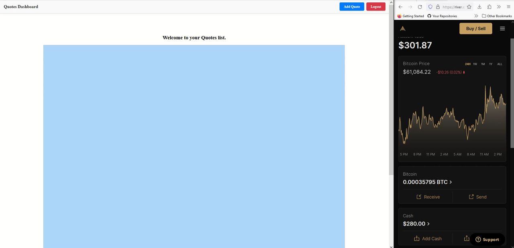

# Quotes Dashboard Application

## Overview
The Quotes Dashboard is a simple application that generates quote cards for invoices with bitcoin amounts and QR codes. Each card features a unique QR code that facilitates payment. Users can drag these cards around freely within the app's interface. When a QR code receives a payment, the application instantly recognizes it and utilizes HTMX to update only the specific card that has been paid. This approach ensures smooth, real-time payment processing and accurate visual feedback, making it easy to monitor transaction statuses at a glance.

### Key Features
- **Lightning Network Payments:** Supports payments over the Lightning Network using the BTCPay Server through Voltage.
- **HTMX Frontend:** Enhances the frontend's responsiveness by leveraging HTMX to dynamically update parts of the page, resulting in faster load times and smoother user interactions.
- **Django Backend:** Powered by the Django framework, providing a secure and scalable foundation for the application.
- **WebSockets:** Delivers real-time notifications to the user, keeping them informed about payment statuses and quote updates as they happen.
- **BTCPay Server Webhooks:** Handles webhook notifications from BTCPay Server to ensure payment data remains consistent.

### Requirements
- **Python 3.x**
- **Django**
- **HTMX**
- **Voltage Account**
- **Redis**: For managing WebSocket connections and background tasks.
- **Daphne**: Asynchronous server to handle WebSockets and HTTP requests.

## Environment Setup
Ensure you have the following fields configured in a `.env.development` file for secure and seamless functionality. **Do not share your sensitive data.** The following fields are required:

```
SECRET_KEY=<your-secret-key>
DEBUG=True
VOLTAGE_KEY=<your-voltage-key>
ALLOWED_HOSTS=localhost,127.0.0.1,<ngrok-address>
CORS_ORIGIN_WHITELIST=http://localhost,http://127.0.0.1,https://<ngrok-address>
CSRF_TRUSTED_ORIGINS=https://<ngrok-address>
VOLTAGE_STORE_ID=<your-store-id>
PAYMENT_WEBHOOK_SECRET=<your-webhook-secret>
API_BEARER_TOKEN=<your-api-bearer-token>
```

### Application Functionality
1. **Quotes Dashboard**: An intuitive dashboard to manage, edit, and create new quotes.
2. **Payment Integration**: Accepts and manages Lightning Network payments via the BTCPay Server.
3. **Real-Time Updates**: WebSocket technology provides live status updates on quote payments.
4. **Payment Verification**: Webhooks ensure all transactions are securely verified and the status is updated accordingly.

### Getting Started
1. Clone the repository.
2. Create a virtual environment and activate it.
3. Install the required packages via `pip install -r requirements.txt`.
4. Add the environment variables in the `.env.development` file.
5. Run the server using `daphne -p 8001 QuoteFlowApp.asgi:application` and `ngrok http --domain=<ngrok-address> 8001` (Assuming the Redis server is running in the background)

### Additional Information
- **Voltage**: [Voltage Cloud Platform](https://voltage.cloud/)
- **HTMX**: [HTMX Documentation](https://htmx.org/docs/)
- **BTCPay Server**: [BTCPay Server](https://btcpayserver.org/)
- **Redis**: [Redis Installation Guide](https://redis.io/download)
- **Daphne**: [Daphne Documentation](https://github.com/django/daphne)

Feel free to customize this template to best suit your needs.

## Tip Me
[BTCPay Server Crowdfund App](https://btcpay0.voltageapp.io/apps/3UCpT9Ln5btcgKH4EdTGRh5jCEAT/crowdfund)
